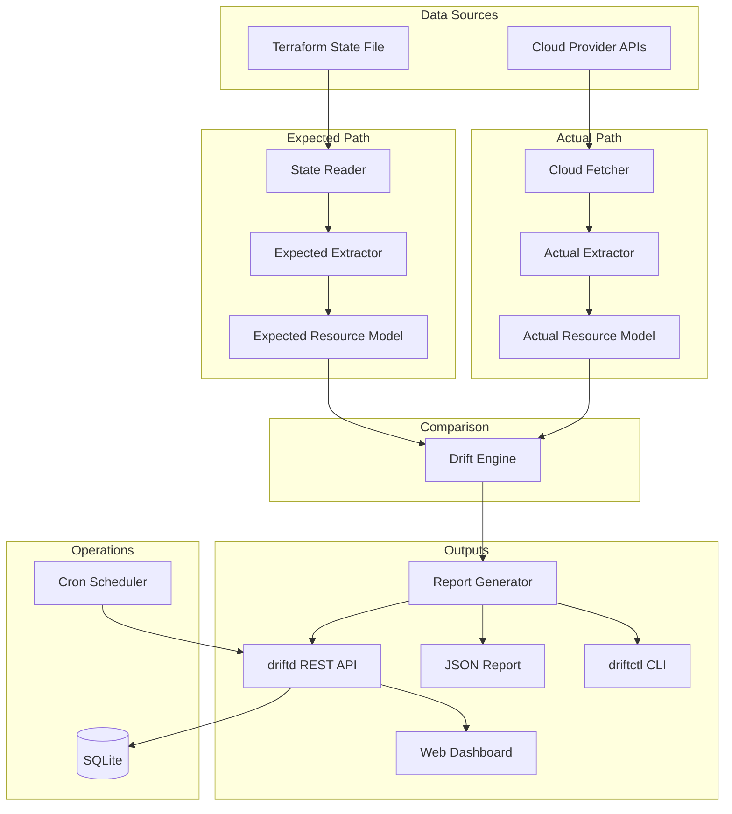

# Terraform Drift Detector

A **cloud-agnostic Terraform drift detection platform** written in Go. It continuously compares Terraform state files against live cloud infrastructure to identify configuration drift — **without running `terraform plan` or `terraform apply`**.

Use it to answer one question quickly: *"Does what Terraform thinks is deployed actually match what's in the cloud?"*

---

## Table of Contents

- [What Is Drift?](#what-is-drift)
- [How It Works](#how-it-works)
- [Architecture](#architecture)
- [Features](#features)
- [Prerequisites](#prerequisites)
- [Installation](#installation)
- [Quick Start](#quick-start)
- [Configuration Reference](#configuration-reference)
- [CLI Usage (`driftctl`)](#cli-usage-driftctl)
- [Server & Dashboard (`driftd`)](#server--dashboard-driftd)
- [REST API](#rest-api)
- [Drift Types](#drift-types)
- [Resource Matching](#resource-matching)
- [Supported AWS Resources](#supported-aws-resources)
- [JSON Report Format](#json-report-format)
- [Extending the Platform](#extending-the-platform)
- [Project Structure](#project-structure)
- [Development](#development)
- [Limitations & Roadmap](#limitations--roadmap)
- [License](#license)

---

## What Is Drift?

**Drift** happens when real infrastructure diverges from what Terraform's state file records as deployed. Common causes include:

- Manual changes in the AWS/Azure/GCP console
- Autoscaling or managed service updates
- Resources deleted outside Terraform
- Tag or attribute edits applied directly in the cloud

This tool detects drift by building two normalized views of your infrastructure and comparing them:

| Source | Meaning |
|--------|---------|
| **Expected** | What Terraform state says should exist |
| **Actual** | What cloud provider APIs report as live |

---

## How It Works

Every scan follows the same pipeline:

```
┌─────────────────────┐          ┌─────────────────────┐
│  Terraform State    │          │   Cloud Provider    │
│  (terraform.tfstate)│          │   APIs (AWS, etc.)  │
└─────────┬───────────┘          └─────────┬───────────┘
          │                                │
          ▼                                ▼
   ┌──────────────┐                 ┌──────────────┐
   │ State Reader │                 │ Cloud Fetcher│
   └──────┬───────┘                 └──────┬───────┘
          │                                │
          ▼                                ▼
   ┌──────────────┐                 ┌──────────────┐
   │  Extractor   │                 │  Extractor   │
   └──────┬───────┘                 └──────┬───────┘
          │                                │
          ▼                                ▼
   ┌──────────────┐                 ┌──────────────┐
   │   Expected   │                 │    Actual    │
   │ Resource Model│                │ Resource Model│
   └──────┬───────┘                 └──────┬───────┘
          │                                │
          └────────────┬───────────────────┘
                       ▼
                ┌──────────────┐
                │ Drift Engine │
                │   (Compare)  │
                └──────┬───────┘
                       ▼
                ┌──────────────┐
                │   Report     │
                │  Generator   │
                └──────┬───────┘
                       │
         ┌─────────────┼─────────────┐
         ▼             ▼             ▼
    Console CLI    JSON Report    Dashboard
```

### Step-by-step

1. **Load Terraform state** — The state reader parses `terraform.tfstate` (local file today). Only `managed` resources are included; `data` sources are skipped.

2. **Fetch live cloud resources** — The cloud fetcher calls provider APIs (AWS SDK v2) in parallel across configured regions and resource types.

3. **Normalize both sides** — Extractors convert Terraform attributes and cloud API responses into a shared `Resource` model with consistent fields: `type`, `cloud_id`, `region`, `attributes`, and `tags`.

4. **Match resources** — The drift engine pairs expected and actual resources primarily by `cloud_id` + `type` + `region` (e.g. EC2 instance ID `i-abc123`).

5. **Compare and classify** — For matched resources, attributes and tags are diffed. Unmatched resources are flagged as missing on one side or the other.

6. **Generate reports** — Results are emitted as console tables, versioned JSON, and/or stored for the API and dashboard.

### Why no `terraform plan`?

Traditional drift detection often relies on `terraform plan`, which requires:

- The Terraform CLI installed
- Provider plugins and variable files
- Access to remote backends and modules

This platform reads state directly and queries cloud APIs, giving **fast, read-only visibility** into infrastructure drift with minimal dependencies.

---

## Architecture



### Components

| Component | Package | Role |
|-----------|---------|------|
| **State Reader** | `internal/state` | Loads and parses Terraform state JSON |
| **Cloud Fetcher** | `internal/cloud` | Plugin interface; AWS implementation fetches live resources |
| **Resource Extractor** | `internal/extract` | Normalizes state and API data into `Resource` models |
| **Drift Engine** | `internal/drift` | Matches resources, diffs attributes/tags, classifies drift |
| **Report Generator** | `internal/report` | Formats output for CLI and JSON |
| **Scanner** | `internal/scan` | Orchestrates the full scan pipeline |
| **API Server** | `internal/api` | REST endpoints and dashboard hosting |
| **Store** | `internal/store` | Persists scan history in SQLite |
| **Scheduler** | `internal/schedule` | Runs recurring scans via cron expressions |

### Binaries

| Binary | Purpose |
|--------|---------|
| `driftctl` | Command-line tool for on-demand scans |
| `driftd` | Long-running server: API, dashboard, scheduler, persistence |

---

## Features

- **State ingestion** — Read local `terraform.tfstate` files
- **Cloud fetching** — AWS provider with parallel region/type workers
- **Drift detection** — Deleted resources, modified attributes, tag changes
- **Configurable ignores** — Skip noisy/computed attributes (ARN, `tags_all`, etc.)
- **Multiple outputs** — CLI tables, JSON reports, web dashboard
- **On-demand scans** — Run manually via CLI or API
- **Scheduled scans** — Cron-based recurring scans via `driftd`
- **REST API** — Trigger scans, query history, filter drifts
- **Extensible** — Plugin-based `CloudProvider` interface for new clouds

---

## Prerequisites

- **Go 1.22+** (for building from source)
- **AWS credentials** (for AWS scans) via environment variables, shared config, or IAM role
- A **Terraform state file** (`terraform.tfstate`) for the infrastructure you want to compare

### AWS credentials

The AWS provider uses the standard AWS SDK credential chain:

```bash
export AWS_ACCESS_KEY_ID="your-key"
export AWS_SECRET_ACCESS_KEY="your-secret"
export AWS_REGION="us-east-1"   # optional; regions are also set in config/flags
```

Alternatively, use `~/.aws/credentials`, IAM instance profiles, or other SDK-supported methods.

---

## Installation

### Build from source

```bash
git clone https://github.com/kirandevops262-spec/Terraform-Drift-Detector-Golang.git
cd Terraform-Drift-Detector-Golang
make build
```

Binaries are written to:

- `bin/driftctl` — CLI
- `bin/driftd` — API server

### Verify

```bash
./bin/driftctl version
# driftctl 1.0.0
```

---

## Quick Start

### 1. Run a CLI scan

Compare a sample state file against live AWS resources:

```bash
./bin/driftctl scan \
  --state testdata/sample.tfstate \
  --provider aws \
  --region us-east-1
```

Example console output:

```
Terraform Drift Report (scan: a1b2c3d4-...)
Duration: 2.3s

Resources: expected=3 actual=15 matched=2
Drift Summary: total=4 missing_in_cloud=1 missing_in_state=12 attribute_changed=1 tags_changed=0

DRIFT TYPE          RESOURCE        TYPE           REGION      DETAILS
missing_in_cloud    aws_vpc.main    aws_vpc        us-east-1   Resource exists in Terraform state but was not found in cloud
attribute_changed   aws_instance.web aws_instance  us-east-1   attributes.instance_type: t3.micro -> t3.small
...
```

Exit code is **non-zero** when drift is detected (useful for CI pipelines).

### 2. Export JSON

```bash
./bin/driftctl scan \
  --state testdata/sample.tfstate \
  --provider aws \
  --region us-east-1 \
  --json ./reports/latest.json
```

### 3. Start the server and dashboard

```bash
./bin/driftd -c configs/drift.example.yaml
```

Open **http://localhost:8080** in your browser. Use **Run Scan** to trigger a scan and view drift history.

---

## Configuration Reference

Configuration is defined in a YAML file. Copy the example to get started:

```bash
cp configs/drift.example.yaml drift.yaml
```

### Full example

```yaml
state:
  source: local
  path: ./terraform.tfstate

providers:
  - name: aws
    regions:
      - us-east-1
      - us-west-2
    credentials: env
    resource_types: []   # empty = all default AWS types

comparison:
  ignore_attributes:
    global:
      - id
      - arn
      - tags_all
      - tags
      - timeouts
      - region
      - account_id
    aws_instance:
      - cpu_core_count

schedules:
  - name: nightly
    cron: "0 2 * * *"
    enabled: true

output:
  console: true
  json_path: ./reports/latest.json
  api_store: true

database:
  driver: sqlite
  dsn: ./drift.db

api:
  addr: ":8080"
  api_key: ""            # set to require X-API-Key header
```

### Configuration keys

| Section | Key | Description |
|---------|-----|-------------|
| `state` | `source` | State backend type (`local` supported) |
| `state` | `path` | Path to `terraform.tfstate` |
| `providers` | `name` | Cloud provider (`aws`) |
| `providers` | `regions` | List of regions to scan |
| `providers` | `credentials` | Credential source (`env` = SDK default chain) |
| `providers` | `resource_types` | Resource types to fetch; empty uses defaults |
| `comparison` | `ignore_attributes` | Attributes to skip during diff (global + per-type) |
| `schedules` | `name` | Schedule display name |
| `schedules` | `cron` | Cron expression (standard 5-field) |
| `schedules` | `enabled` | Whether schedule is active |
| `output` | `console` | Print human-readable report |
| `output` | `json_path` | Write JSON report to file |
| `database` | `dsn` | SQLite database path |
| `api` | `addr` | HTTP listen address |
| `api` | `api_key` | Optional API key for authentication |

---

## CLI Usage (`driftctl`)

### Commands

```bash
driftctl scan [flags]    # Run a drift scan
driftctl version         # Print version
```

### `scan` flags

| Flag | Short | Description |
|------|-------|-------------|
| `--config` | `-c` | Path to `drift.yaml` config file |
| `--state` | | Path to `terraform.tfstate` (overrides config) |
| `--provider` | | Cloud provider name (`aws`) |
| `--region` | | Region(s) to scan (repeatable) |
| `--output` | | Output format: `json` |
| `--json` | | Write JSON report to file path |
| `--no-console` | | Suppress table output |

### Examples

```bash
# Scan with config file
./bin/driftctl scan -c drift.yaml

# Override state path and regions
./bin/driftctl scan \
  --state ./prod/terraform.tfstate \
  --provider aws \
  --region us-east-1 \
  --region eu-west-1

# JSON to stdout (for piping to jq)
./bin/driftctl scan --state ./terraform.tfstate --provider aws --region us-east-1 --output json

# CI-friendly: exits 1 if drift found
./bin/driftctl scan -c drift.yaml || echo "Drift detected!"
```

---

## Server & Dashboard (`driftd`)

`driftd` is the long-running service that provides:

- REST API for programmatic access
- SQLite persistence of scan history
- Cron scheduler for recurring scans
- Web dashboard at `/`

### Start the server

```bash
./bin/driftd -c configs/drift.example.yaml
```

### Dashboard features

- **Run Scan** — Trigger an on-demand scan via API
- **Scan History** — View past scans with status and drift counts
- **Drift Details** — Drill into per-resource findings
- **Export JSON** — Download the full report for a scan

### Scheduled scans

Schedules defined in your config file are loaded at startup. Example: run every night at 2 AM UTC:

```yaml
schedules:
  - name: nightly
    cron: "0 2 * * *"
    enabled: true
```

Cron uses the standard 5-field format: `minute hour day month weekday`.

---

## REST API

Base URL: `http://localhost:8080`

### Authentication

If `api.api_key` is set in config, include it on protected endpoints:

```bash
curl -H "X-API-Key: your-secret-key" http://localhost:8080/api/v1/scans
```

If `api_key` is empty, authentication is disabled.

### Endpoints

| Method | Path | Auth | Description |
|--------|------|------|-------------|
| `GET` | `/api/v1/health` | No | Health check |
| `POST` | `/api/v1/scans` | Yes | Trigger on-demand scan |
| `GET` | `/api/v1/scans` | Yes | List scan history |
| `GET` | `/api/v1/scans/{id}` | Yes | Get scan metadata |
| `GET` | `/api/v1/scans/{id}/report` | Yes | Full JSON drift report |
| `GET` | `/api/v1/scans/{id}/drifts` | Yes | Drift items (filterable) |
| `POST` | `/api/v1/schedules` | Yes | Create a schedule |
| `GET` | `/api/v1/schedules` | Yes | List schedules |
| `GET` | `/` | No | Web dashboard |

### API examples

**Health check**

```bash
curl http://localhost:8080/api/v1/health
# {"status":"ok"}
```

**Trigger a scan**

```bash
curl -X POST http://localhost:8080/api/v1/scans
```

**List scans**

```bash
curl http://localhost:8080/api/v1/scans
```

**Get full report**

```bash
curl http://localhost:8080/api/v1/scans/{scan-id}/report
```

**Filter drifts by type**

```bash
curl "http://localhost:8080/api/v1/scans/{scan-id}/drifts?type=tags_changed"
```

**Create a schedule**

```bash
curl -X POST http://localhost:8080/api/v1/schedules \
  -H "Content-Type: application/json" \
  -d '{
    "name": "hourly",
    "cron": "0 * * * *",
    "enabled": true
  }'
```

---

## Drift Types

| Type | Description | Example |
|------|-------------|---------|
| `missing_in_cloud` | Resource is in Terraform state but not found in the cloud | VPC deleted manually in console |
| `missing_in_state` | Resource exists in the cloud but is not in Terraform state | Orphaned EC2 instance |
| `attribute_changed` | Matched resource has differing non-tag attributes | `instance_type` changed from `t3.micro` to `t3.small` |
| `tags_changed` | Matched resource has tag differences | `Environment` tag changed from `prod` to `staging` |
| `type_mismatch` | Same match key but different resource types | Rare; indicates mapping issues |

Each drift item includes:

- `terraform_ref` — e.g. `aws_instance.web`
- `cloud_id` — e.g. `i-0abc123`
- `changes[]` — path-based diffs like `attributes.instance_type` or `tags.Environment`

---

## Resource Matching

Resources are matched between expected and actual sets using this priority:

1. **Primary key** — `cloud_id` + `type` + `region`
2. **Fallback** — `cloud_id` + `type` across regions

The `cloud_id` comes from the Terraform state `id` attribute (e.g. `i-abc123` for EC2, bucket name for S3).

### Ignored attributes

To reduce false positives, certain attributes are excluded from comparison:

**Global defaults:**

`id`, `arn`, `tags_all`, `tags`, `timeouts`, `region`, `account_id`, `unique_id`, `owner_id`, `private_dns`, `public_dns`

**Per-type overrides** can be set in config under `comparison.ignore_attributes`.

Tags are compared separately and reported as `tags_changed` rather than `attribute_changed`.

---

## Supported AWS Resources

When `resource_types` is empty, these types are fetched by default:

| Terraform Type | AWS API |
|----------------|---------|
| `aws_instance` | EC2 `DescribeInstances` |
| `aws_s3_bucket` | S3 `ListBuckets` + `GetBucketTagging` |
| `aws_vpc` | EC2 `DescribeVpcs` |
| `aws_subnet` | EC2 `DescribeSubnets` |
| `aws_security_group` | EC2 `DescribeSecurityGroups` |
| `aws_lambda_function` | Lambda `ListFunctions` + `ListTags` |

Fetching runs in parallel across regions (up to 4 concurrent workers per region/type).

To limit scope, set explicit types in config:

```yaml
providers:
  - name: aws
    regions: [us-east-1]
    resource_types:
      - aws_instance
      - aws_s3_bucket
```

---

## JSON Report Format

Reports use `report_version: "1.0"` for stable programmatic consumption.

```json
{
  "report_version": "1.0",
  "scan_id": "550e8400-e29b-41d4-a716-446655440000",
  "started_at": "2026-07-16T07:00:00Z",
  "completed_at": "2026-07-16T07:00:02Z",
  "summary": {
    "total": 2,
    "missing_in_cloud": 1,
    "missing_in_state": 0,
    "attribute_changed": 1,
    "tags_changed": 0,
    "type_mismatch": 0,
    "by_resource_type": {
      "aws_instance": 1,
      "aws_vpc": 1
    }
  },
  "resources": {
    "expected_count": 3,
    "actual_count": 15,
    "matched_count": 2
  },
  "drifts": [
    {
      "resource_id": "aws:aws_instance:i-abc123",
      "terraform_ref": "aws_instance.web",
      "type": "aws_instance",
      "provider": "aws",
      "region": "us-east-1",
      "cloud_id": "i-abc123",
      "drift_type": "attribute_changed",
      "changes": [
        {
          "path": "attributes.instance_type",
          "expected": "t3.micro",
          "actual": "t3.small"
        }
      ],
      "message": "1 attribute change(s) detected"
    }
  ]
}
```

---

## Extending the Platform

### Add a new cloud provider

Implement the `CloudProvider` interface in `internal/cloud/provider.go`:

```go
type Provider interface {
    Name() string
    Fetch(ctx context.Context, scope FetchScope) ([]extract.RawCloudResource, error)
    SupportedTypes() []string
}
```

1. Create a package under `internal/cloud/<provider>/`
2. Implement `Fetch` to call provider APIs and return `RawCloudResource` slices
3. Map API fields to Terraform attribute names for accurate diffs
4. Register the provider in `cmd/driftctl/main.go` and `cmd/driftd/main.go`

### Add a new resource type (AWS)

1. Add the type to `DefaultResourceTypes` in `internal/cloud/aws/provider.go`
2. Implement a `fetch<Type>` method using the appropriate AWS SDK client
3. Map response fields to Terraform attribute keys in the `Attributes` map

### Add a new state backend

Implement the `state.Reader` interface:

```go
type Reader interface {
    Read() (*RawState, error)
}
```

Register it in `state.NewReader` for backends like S3, GCS, or Azure Blob.

---

## Project Structure

```
.
├── cmd/
│   ├── driftctl/           # CLI entrypoint
│   └── driftd/             # API server entrypoint
├── internal/
│   ├── api/                # REST API + dashboard routes
│   ├── cloud/
│   │   ├── provider.go     # CloudProvider interface
│   │   └── aws/            # AWS implementation
│   ├── config/             # YAML configuration
│   ├── drift/              # Comparison engine
│   ├── extract/            # Resource normalization
│   ├── report/             # Console + JSON formatters
│   ├── scan/               # Scan orchestration
│   ├── schedule/           # Cron scheduler
│   ├── state/              # Terraform state reader
│   └── store/              # SQLite persistence
├── pkg/
│   └── models/             # Shared domain types
├── web/
│   └── dashboard/          # Static web UI
├── configs/
│   └── drift.example.yaml  # Example configuration
├── testdata/
│   └── sample.tfstate      # Test fixture
├── Makefile
├── go.mod
└── README.md
```

---

## Development

### Run tests

```bash
make test
```

Tests cover the drift engine, state parsing, extractors, report formatting, and SQLite store. Cloud API calls are not required for unit tests.

### Lint

```bash
make lint
```

### Sample scan (may require AWS credentials)

```bash
make run-scan
```

### Makefile targets

| Target | Description |
|--------|-------------|
| `make build` | Build `bin/driftctl` and `bin/driftd` |
| `make test` | Run all tests |
| `make lint` | Run `go vet` |
| `make clean` | Remove `bin/` |
| `make run-server` | Build and start `driftd` |
| `make run-scan` | Build and run a sample CLI scan |

---

## Limitations & Roadmap

### Current limitations

- **State backends** — Local file only (no S3/GCS remote state yet)
- **Cloud providers** — AWS only (Azure/GCP planned)
- **Data sources** — Terraform `data` blocks are excluded from comparison
- **Module resolution** — State file is the source of truth; HCL/modules are not parsed
- **Remediation** — Detection only; no auto-fix or `terraform apply`

### Roadmap

- [ ] S3 remote state backend
- [ ] Azure and GCP provider plugins
- [ ] Postgres database support
- [ ] Prometheus metrics
- [ ] Configurable resource matching rules
- [ ] Rate limiting and API backoff tuning

---

## License

MIT
